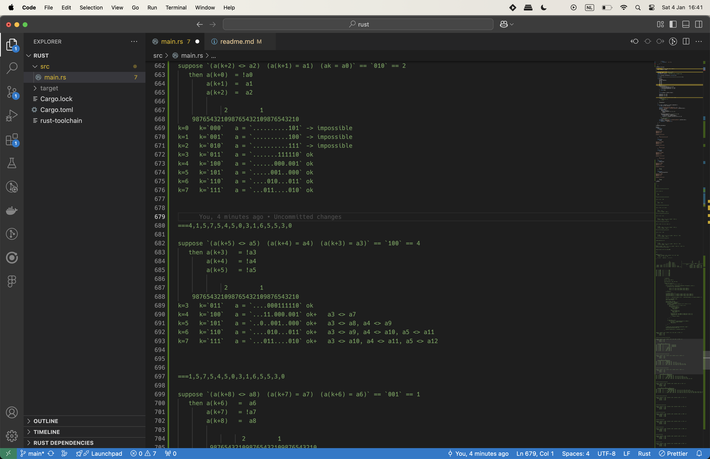
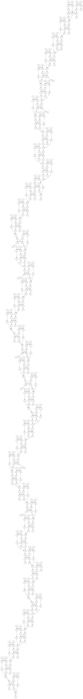

# Advent of Code 2024 🎄

See https://adventofcode.com/2024

## Links

- [Previous year's repo](https://github.com/kelleyvanevert/adventofcode2023)
- Friends also participating:
  - [Auke](https://github.com/Fadarrizz/advent-of-code/tree/main/2024/)
  - [Luka](https://github.com/orglce/aof2024)

## Getting started

1. Decrypt the input files with `./decrypt.sh <password>`, of add your own (to e.g. `./inputs/input_09.txt`)
2. Some days are coded in AL (Adventlang), others in Rust.
   - For the Rust days, just run them with `cargo run --release` from within the Rust day's project dir
   - For the AL days, run them from the root project dir like so: `al run -t day09/al/main.al < inputs/input_09.txt`
     - How to get the `al` binary:
       - Clone [my 2023 Advent of Code repo](https://github.com/kelleyvanevert/adventofcode2023)
       - Build and install it with `build.sh` in the `./adventlang` dir

## Shout-out to my go-to Rust crates

Here's the five crates that I've found myself pretty much always using to solve this and previous year's Advent of Code:

| Crate                                                                         | why                                                                                                                                                                                                                                                                                                               |
| ----------------------------------------------------------------------------- | ----------------------------------------------------------------------------------------------------------------------------------------------------------------------------------------------------------------------------------------------------------------------------------------------------------------- |
| [fxhash](https://docs.rs/ccl-fxhash/latest/fxhash/)                           | This is my go-to HashMap and HashSet crate. It's way faster than the stdlib defaults, at the cost of being not cryptographically secure, which I don't need here anyway.                                                                                                                                          |
| [itertools](https://docs.rs/itertools/latest/itertools/)                      | Just so many useful swiss armyknife thingies related to iterators... I use `collect_vec`, `all`, `any`, `chain`, `sorted` etc. all the time                                                                                                                                                                       |
| [cached](https://docs.rs/cached/0.54.0/cached/)                               | Super easy dynamic programming! Just stick `#[cached]` onto your `fn`                                                                                                                                                                                                                                             |
| [rayon](https://docs.rs/rayon/latest/rayon/)                                  | Super easy parallelization with things like `into_par_iter` — it's a fun way to get my solution down to under a second again :)                                                                                                                                                                                   |
| [binary-heap-plus](https://docs.rs/binary-heap-plus/latest/binary_heap_plus/) | I only started using this on day 18, but it seems like something I've been missing for a long time. Instead of having to define a new type and implement `PartialOrd` and `Ord` before I can start implementing search algorithms with a `BinaryHeap`, I can now just use `BinaryHeap::new_by_key(..)` — amazing! |

## Day 1

Solved in Google Sheets, because Chen said "Oh, I don't need to learn Python for this, I can just do it in Excel!"

Impression of the first part:

```
=ABS(A1-B1)
=SUM(C:C)
```

Impression of the second part:

```
=countif(B:B,A1)
=A1*C1
=SUM(D:D)
```


## Day 2

Solved the first part in Google Sheets, because I wanted to see how far I'd get with it :P But then quickly realized I'd already hit that end when I saw the bonus challenge..

Impression of the first part:

```
=AND(MAP($A11:$G11, $B11:$H11, LAMBDA(a, b, IF(b, a<b, true))))
=AND(MAP($A11:$G11, $B11:$H11, LAMBDA(a, b, IF(b, a>b, true))))
=AND(MAP($A11:$G11, $B11:$H11, LAMBDA(a, b, IF(b, AND(abs(a-b) >= 1, abs(a-b) <= 3), true))))
=and(or(J11:K11),L11)
=COUNTIF(M:M,true)
```


For the bonus part I turned to Gleam, because that seemed fun. However, while using the language, I started to get turned off, because they seem to have an inclination to follow "ergonomic functional-style" syntax ... and .. let's be honest, it's simply the same but less ergonomic than .. Adventlang! :D So then afterwards I also coded the first part in Adventlang for comparison. (The bonus would be a bit harder, I might need to add more stuff to the stdlib.)

Side-by-side:


## Day 3, 4, 5

Fun and not too easy -- except day 5's bonus, which was actually quite the surpise for me. I don't know whether I was juist brainfarting, or it was actually so hard, but it took me quite some iterations :P

## Day 6

Today was a bad day for Adventlang..

- A found a bug that must have been in AL for a long time already:

  ```al
  let a = 1
  let u = (4, a)
  b = 2
  // u is now (4, 2) but should still be (4, 1)
  ```

  the simple solution is to sprinkle some `:clone`s throughout the code for now 😓

- There's a syntax / parsing bug, where it doesn't recognize this code:

  ```al
  if (a, b) == (1, 5) {
    ...
  }
  ```

- And, to put the nail in the coffin, it was suuper slow in computing, and eventually ate too much memory to be able to complete, the bonus part of today's challenge.

..so I took to Rust to solve the bonus part. My brute force solution is of course not the most beautiful way of solving it, and there'll most definitely be a way to solve the whole thing way faster, and then also in AL, but .. oh well..

_Update: I realized the kinda obvious first optimization that makes it a whole lot faster: only check obstruction placements along the path that the guard is going to walk anyway. This way, AL can get the job done in 6 minutes, and Rust in 400ms ☺️_
w

## Day 7

Fun and not too hard :)

## Day 8

Also fun and not too hard, except .. I did it in Rust, because Adventlang as yet another syntax problem 😓 — this apparently doesn't work:

```al
antennas[a] []= (x,y)
```

## Day 9

I'm embarrassed how long today took me! XD Let's maybe just say my brain was fried today... I don't know why I decided to start off the first part encoding the list of disk items semantically, instead of a just an offset-based vector like in the (eventual) bonus solution .., but it definitely led me into a whole world of imperative algorithmic pain. It worked though, and although it's ugly, I was kinda proud, and then continued to try the bonus that way as well, but then ran into various problems, including having read the problem statement wrong, before just codifying the disk vector more straightforwardly like in the example's ASCII art.. which then immediately led me to a working solution way faster. Ugh, ok, well ...

## Day 10

Nice :)

## Day 11

Simple, because I know by know, having done Advent of Code before, that this is a dynamic programming problem that can be super easily expressed with the `#[cached]` macro from the `cached` crate 😉 ±20 minutes to complete, and ±20 milliseconds to compute (the bonus).

## Day 12

The first part was a fun little exercise of the "flood gathering" algorithm (just named it that way myself). And then the bonus was a fun challenge that turned out just a bit more tricky than I though, because of my encoding of edges and the existence of diagonally adjacent regions.. See below, the most interestingly formatted + commented function I might have ever made in Rust :P


## Day 13

Today was all about whether I can still muster up enough linear algebra maths 😅 I managed, though


## Day 14

Today's challenge started with a little speed-run, trying to solve it in 30 minutes before leaving with Chen to Markus + Priyanka to play Warhammer :P I was able to get the first part just in time, and then saw taht the bonus would require by-eye verification and probably using images and whatnot .. so I postponed to the next day :) The next day, I just went ahead and generated lots of png grids of each next 100 steps, and then verified them by eye, until we found it in the 75th grid! So cute!


## Day 15

Today was pretty hard! The first part as OK, but then I got stuck on an algorithmic detail in the bonus part for an hour or two :O The generalization of the bonus part was fun. The way I set it up, instead of looking each subsequent next grid cell, while walking through the 'ramifications' of what it would mean to move in a certain direction, we need to now look at each subsequent next 'frontier' of grid cells. But I forgot to remove empty gird cells from the frontier, and then had to manually verify a lot of the moves taken to finally find the move where it went wrong, in the test example. Which was here:

```
[504] MOVING robot (7, 4) dir v (0, 1)...

Grid before:
####################
##[]...[].....[][]##
##[]...........[].##
##............[][]##
##.....@....[].[].##
##..##[]....[][]..##
##...[]...[]..[]..##
##.....[]..[].[][]##
##........[]......##
####################

Grid after:
####################
##[]...[].....[][]##
##[]...........[].##
##............[][]##
##..........[].[].##
##..##.@....[][]..##
##....[]..[]..[]..##
##...[]....[].[][]##
##.....[].[]......##
####################
```

Indeed, 504 moves in 😅 You can see it going wrong. As soon as I found this little bug, the algorithm worked and I was able to compute the answer, in about 3ms 💪

## Day 16, 17

Pretty hard! Of both these days, I'm (still) having a hard time getting the bonus :P

_Update (Jan 2nd): I solved the bonus of day 16 🤘_

_Update (Jan 4th): I finally solved day 17's bonus, after a LOT of struggling with bit patterns and multiple different attempts and strategies :P I kinda cheated in the end though, using Z3 to solve the system of equations about `A`'s bit pattern, while minimizing `A`. I was also just about to code another attempt that's more hand-crafted, after failing at getting the Z3 solution to work, while I found a bug in my Z3 solution, the fixing of which led to the right solution. Here's some pics of the process:_




_To get to the Z3 solution, I first analyzed specifically my input's program, which reads: `2,4,1,5,7,5,4,5,0,3,1,6,5,5,3,0`. In pseudocode, this reads:_

```
while A > 0 {
  B <- A
  B <- B xor `101`
  C <- floor(A / 2^B)
  B <- B xor C
  A <- floor(A / 2^3)   --i.e.--   A <- A >> 3
  B <- B xor `110`
  output(B % 8)
}
```

_The initial values of the `B` and `C` registers are not important. Basically, the program just iteratively takes the next three bits from `A`, does some stuff with it to produce three bits, and then outputs these as a number. We know what these output numbers should be, and there's a relation between the output and `A`, but it's not just the three bits, because there's a weird "shifting" going on as well. It took me some painstaking bit-tracking, but it can be written like so:_

```math
\begin{aligned}
(a_{3i+2} \ne a_{s_i+2}) &= t_{i,2} \\
(a_{3i+1} = a_{s_i+1}) &= t_{i,1} \\
(a_{3i+0} = a_{s_i+0}) &= t_{i,0}
\end{aligned}
```

_in which $s_i$ is defined by these bits:_

```math
s_i := \langle \; \neg a_{3i+2} \;\; a_{3i+1} \;\; \neg a_{3i+0} \; \rangle
```

_and the i-th output number contains these bits:_

```math
t_i := \langle \; t_{i,2} \;\; t_{i,1} \;\; t_{i,0} \; \rangle
```

_Essentially, each subsequent outputted number $t_i$ is determined by a "quirky" combination of a subsequent segment of three bits of the original `A`, as well as a three-bit segment a bit further down in the original `A`, in which the "further-down-ness" is determined by $s_i$, itself a quirky reinterpretation of the subsequent three-bit segment of `A`._

_After some painstaking effort and details gone wrong, I was able to put all these equations into Z3 in the right way, and then solved for minimal `A`. Interestingly, this is only really possible by Z3's feature of "arrays", by which I was able to do the weird "shifting thing", i.e. indexing `a[si+1]` where `si` is itself already a variable. Impressive, Z3!_

## Day 19

Not as easy as you'd think, and very rewarding to solve! The trick is to divide the pattern up as strategically as possible, instead of just starting from the start an working your way down to the end. See the comments in the code!

## Slacking...

I started slacking after the previous two days, because of a combo of wanting to proceed sequentially, and having other things to do :P

I'll be solving the rest still, but not anymore in the structured, daily, documented way that I've been doing up until now :)

## Day 21, 22, 23

Fun :) Able to solve them before new year's even, is all I'll say about it

## Day 18, 20

Not too hard — I had a fun time on Jan 2nd + 3rd solving these :)

## Day 24

The first part is easily doable, the second part .. will indeed require Z3 again, like the day 24's bonus of previous years :P I haven't gotten around to taking enough to think this one through yet...

_Update (Jan 5th): I finally was able to solve it, after I decided it wasn't fruitful to try to programmatically/generically solve it with Z3. Instead, I printed the computation graph out as a dot file and visualized it with GraphViz to see what was going on. Looking at the graph for a bit revealed the structured pattern that it adhered to ("11 nodes between each successive `OR`"), basically just a clever variation on the regular "add two binary represented numbers with carry" pattern. And then I went ahead to catch all the deviations from this pattern manually. I was aided with Z3 though, because I left the bit of Z3 code that would go and check for up until which bit there were no errors._

```rust
for i in 0..size {
    // Check whether x+y=z up to bit i
    println!(
        "x[..={i}] + y[..={i}] != z[..={i}] ? {:?}",
        solver.check_assumptions(&[
            x.extract(i, 0).bvadd(&y.extract(i, 0))
              ._eq(&z.extract(i, 0))
              .not()
        ])
    );
}
```

_This way, the first line that would spit out `Sat` would be the erroneous bit calculation that I needed to go and fix, and after fixing it in an amended copy fo the input file, I could run the code again, and repeat the process until I was done._

```
...
x[..=34] + y[..=34] != z[..=34] ? Unsat
x[..=35] + y[..=35] != z[..=35] ? Unsat
x[..=36] + y[..=36] != z[..=36] ? Unsat
x[..=37] + y[..=37] != z[..=37] ? Sat  <-- the next erroneous bit
x[..=38] + y[..=38] != z[..=38] ? Sat
...
```

_Here's the generated dot graph btw (before fixing the errors):_



## Day 25

First part's easy, but ... I'mma have to solve day 17's bonus + day 24's bonus first, before I can complete 25's bonus, as expected 😅

_Update (Jan 5th): I'm all done now! 🤘 Overall, loved this year's Advent of Code again. The bonuses of day 17 and 24 were the hardest for me, this year. I somehow thought that day 24 would be "traditionally" a Z3-day, but I was wrong, I really needed Z3 for day 17, but not for day 24. Day 24 was just some dirty manual work that I had postponed for too long because I thought I could cleverly circumvent it :P_
